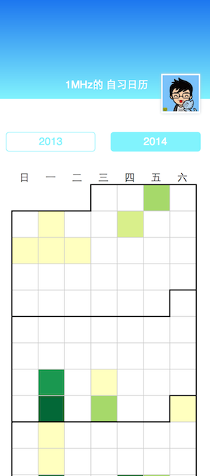
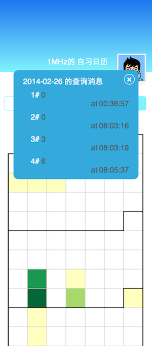

# 北邮自习室查询自习日历

## 说明

本项目实现了对北邮自习室查询用户查询数据的可视化。

项目本身没有后台支持，仅仅是对1MHz的2013年与2014年的查询数据进行了可视化，绘制了两年的自习日历。

## 规则

绘制规则是，某一天的查询次数越多，这一天的色块越深。如果没有查询，则色块为空白。点击某一日可以查看当日的所有查询消息。

## 依赖

1. D3.js

2. jquery

## 截图

###日历首页

###查看当日查询消息

